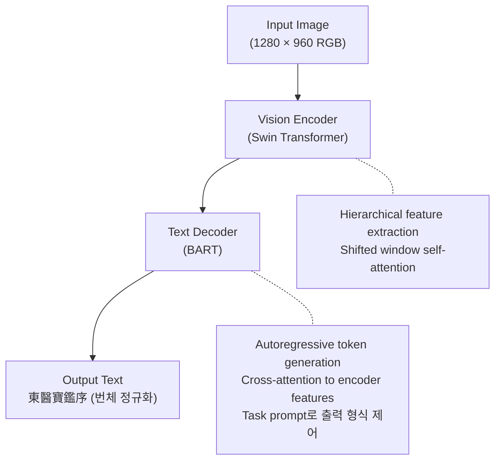
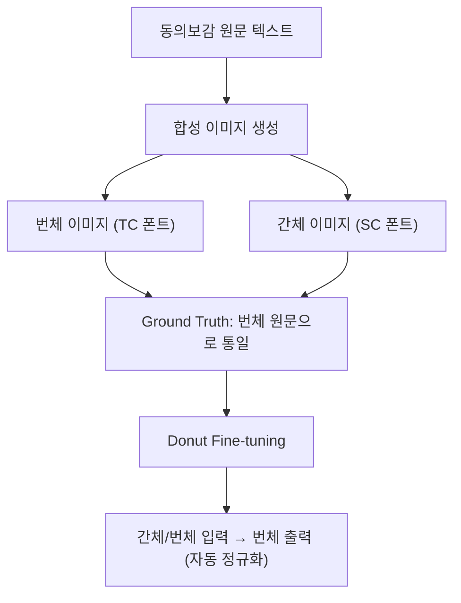
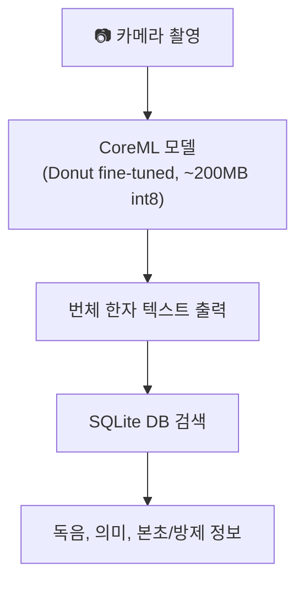
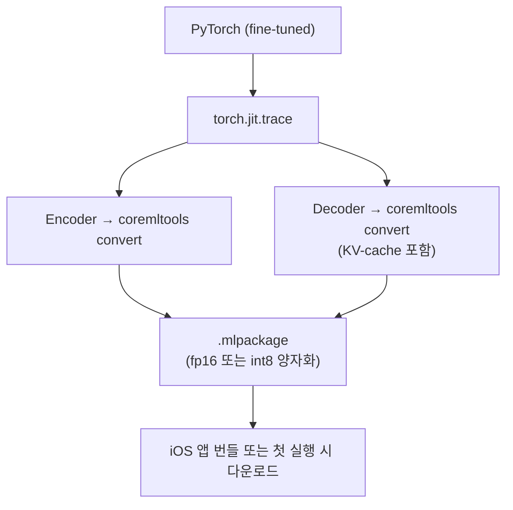

# Donut OCR-Free Document Understanding - HanjaDic 아키텍처

## 모델 개요

**Donut** (Document Understanding Transformer)은 네이버 클로바(naver-clova-ix)가 개발한 OCR-free 문서 이해 모델이다.

기존 문서 처리가 `OCR → NLP` 2단계 파이프라인인 반면, Donut은 이미지에서 직접 텍스트/구조를 생성하는 end-to-end 모델이다.

```
기존:  이미지 → [OCR 엔진] → 텍스트 → [NLP 모델] → 구조화된 출력
Donut: 이미지 → [Encoder-Decoder] → 구조화된 출력
```

## 모델 아키텍처



## HanjaDic에서의 활용

### 학습 전략



### 추론 파이프라인 (앱 내)



## 모델 스펙

| 항목 | 값 |
|------|-----|
| Encoder | Swin Transformer (base) |
| Decoder | BART (mBART 기반) |
| 입력 해상도 | 1280 × 960 |
| 파라미터 수 | ~200M |
| 원본 크기 | ~800MB (fp32) |
| 양자화 후 | ~200MB (int8) |
| Vocab | 57,522 tokens (multilingual) |

## 태스크 프롬프트

Donut은 디코더에 태스크 프롬프트를 주입하여 출력 형식을 제어한다:

```python
# CORD (영수증 파싱) - 기존 fine-tuned 예시
task_prompt = "<s_cord-v2>"

# HanjaDic (한의서 한자 인식) - 커스텀
task_prompt = "<s_hanjadic>"
# 출력: {"text": "東醫寶鑑序"}
```

## Fine-tuning 데이터셋

| 항목 | 내용 |
|------|------|
| 소스 | 동의보감 원문 (dongeuibogam_raw.jsonl) |
| 원본 수 | ~10,962건 |
| 생성 이미지 | ~22,000장 (번체 + 간체 각 1장) |
| 폰트 | Songti TC/SC, STSong (5개 사이즈) |
| Augmentation | 블러, 회전, JPEG 압축 노이즈 |
| Train/Val | 90% / 10% |

## CoreML 변환 경로



### iOS 추론 루프 (Swift)

```swift
// 1. Encoder 실행 (1회)
let encoderOutput = encoderModel.prediction(pixelValues: image)

// 2. Decoder 루프 (autoregressive)
var tokens: [Int] = [startTokenId]
while tokens.last != eosTokenId {
    let decoderOutput = decoderModel.prediction(
        inputIds: tokens,
        encoderHiddenStates: encoderOutput
    )
    let nextToken = decoderOutput.logits.argmax()
    tokens.append(nextToken)
}

// 3. 토큰 → 텍스트 디코딩
let text = tokenizer.decode(tokens)
```

## 참고 자료

- [Donut 논문](https://arxiv.org/abs/2111.15664) - OCR-free Document Understanding Transformer
- [GitHub: naver-clova-ix/donut](https://github.com/clovaai/donut)
- [HuggingFace: naver-clova-ix](https://huggingface.co/naver-clova-ix)
